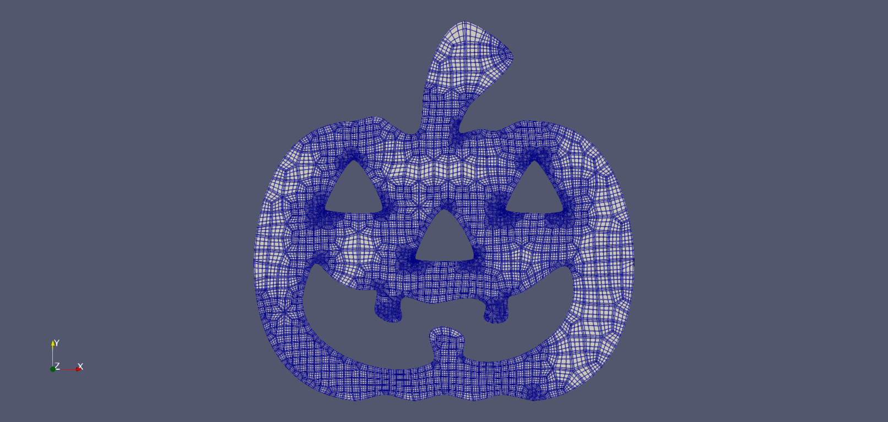

# svg-to-HOHQMesh
A simple script to generate [HOHQMesh]() `.control` files from SVGs.


## Requirements

- [Inkscape](https://inkscape.org/)
- [HOHQMesh](https://github.com/trixi-framework/HOHQMesh)
- Python package requirements can be found in `requirements.txt`


## Getting Started

In **Inkscape**, you must create at least one layer labelled *OuterBoundary*. This layer should **only contain one path**, which will serve as the outermost boundary for the 2D mesh.

For more topologically complex meshes, you will need to create a layer called *InnerBoundaries*. This layer can contain as many paths as you wish, as long as you adhere to the common sense of mesh generation (e.g., paths should not overlap, paths should be contained in the OuterBoundary layer, etc).

(You can also create other layers if you wish, but these will not be parsed into the `.control` file. For example, it might be useful to have a "scratch" layer that is used to hold paths you are still experimenting with.)

Each path should be given a label in Inkscape. When you create a new path in Inkscape, Inkscape automatically generates an `id`, e.g., `path-2`, but this is not enough. When the SVG is parsed, we look for the `inkscape:label` attribute. (Falling back to `id` is planned in a future update.)

Non-`<path>` SVG elements must be converted to paths. This includes polygons, ellipses, rectangles, text, and other objects which are not defined by the `<path>` attribute. Mozilla provides [excellent documentation](https://developer.mozilla.org/en-US/docs/Web/SVG) on the SVG format, which includes information on specific elements, and attributes for each of these elements. This can be done in Inkscape by selecting a non-path object, and then clicking **Path -> Object to Path** or by pressing **Shift+Ctrl+C**.

Elements also must have all transforms baked in. These include *Move*, *Scale*, *Rotate*, *Skew*, and *Matrix*. To view the **Transform** tab in Inkscape, go to **Objects -> Transform...** or press **Shift+Ctrl+M**. The coordinates are generated from the `<d>` attribute of the path element in the SVG. When you create a new Object (say, a triangle), and rescale and rotate it, these operations are saved under the *transform* attribute of that path within the SVG, not baked into `<d>`. You can apply all transforms by clicking through each tab (*Move*, *Scale*, *Rotate*, *Skew*, and *Matrix*) and just clicking **Apply** with all default values. You should notice the asterisk (*) appear before the filename to indicate that the file has been changed. (If not, there may not be any transforms to apply for you particular object.)

This script works by using [`svgpathtools`](https://github.com/mathandy/svgpathtools) to generate six points (endpoints included) between each segment of a path. A segment is the set of points between two nodes; e.g., the curve between two cubic spline nodes. This works by parsing `<d>`, iterating through each segments, and generating points for each. More detailed information about segments can be found in [Mozilla's documentation](https://developer.mozilla.org/en-US/docs/Web/SVG/Attribute/d).

The final step is to confirm that all paths are oriented **counter-clockwise**. This can be done visually by selecting all paths, and then opening the **Fill and Stroke** tab by clicking **Object -> Fill and Stroke...** or by pressing **Shift+Ctrl+F**. Click the "Stroke paint" tab, select an arbitrary color. Then go to the "Stroke style" tab, navigate to the middle menu by "Markers:", and selecting an arrow marker. If the arrows are pointing counter-clockwise, you're good to go. If your path is oriented clockwise, click on **Path -> Reverse**, and you should see the arrow markers reverse direction. (At this point you can remove the outline, or keep them, or customize them however you wish. Outlines are kept in the `style` attribute, and thus are not parsed into the control file at all.)

At this point, there are a few final checks to be done. Currently, this script only creates `.control` files using millimeters (mm) as units. You can use whichever units in Inkscape, but everything will be saved using mm. It is also good to check that there are not bunched nodes. This can be visually checked by using the arrow markers; obviously, if there are several bunched up, you may have two or more nodes in close proximity. This is especially good to look out for if you have performed boolean operations, or if you have used **Trace bitmap...**.

Now, you should be good to save your SVG, and generate a `.control` with `python svg-to-control.py <your-file-name>.svg`. This will also generate a `coordinates.csv`, which may be useful for debugging.


## Example: Pumpkin


Constructing a pumpkin SVG in Inkscape.

All assets for this example can be found in `examples/pumpkin`. There are a few different `.svg`'s here: `pumpkin-raw.svg` (the file we will be starting with), `pumpkin.svg` (a sort of "ideal form" `svg`), and `pumpkin-smooth.svg` (a smoothed variation to accomodate meshing).

We will start with `pumpkin-raw.svg`. We recommend the user open `pumpkin-raw.svg` in a text editor and examine what a raw SVG file looks like. (SVG is just an extension of XML, so there may be some familiarity there.) Notice the `<g>` elements (think "g for group"), and the `<path>` child elements in each of these. Each `<g>` should have an `inkscape:label` attribute with values corresponding to inner and outer boundaries. Each `<path>` child element should also have these attributes, with labels corresponding to the eyes, nose, mouth, and outer pumpkin shape.

Each `<path>` element should also have a `d` attribute. This is the main source of information from which `svgpathtools` parses coordinate data. As stated above, Mozilla provides [thorough documentation](https://developer.mozilla.org/en-US/docs/Web/SVG/Attribute/d) for the expressions utilized in `d`.

In this "raw" pumpkin file, also notice that the `transform` attributes are still present. We will seek to eliminate these, as we need the transform information should be "baked into" `d`. Similarly, notice how the eyes and nose paths have the attribute `sodipodi:type="star"`; this is more or less Inkscapes version of a polygon object.

To reduce these down to basic `path` objects, select each of them in Inkscape, and click **Path -> Object to Path** in the toolbar. If you save look back at the SVG, you should see a bunch of extra information is now gone from those elements. (Strictly speaking, everything should still work fine with all this extra information, but we will not be able to perform path-specific operations on it if Inkscape still sees it as a polygon.)

Now that each element is a path, we can bake in all our transforms. To do this, select each path and open the **Transform** tab by clicking **Objects -> Transform...**. Iterate over each of the tabs (*Move*, *Scale*, *Rotate*, *Skew*, and *Matrix*) and hit **Apply** with the default values. As stated above, you should notice the asterisk (*) in front of the file name at the top, indicating that the file has changed. Save it and look again at the SVG and you should see that the `transform:` attributes are gone.

Finally, we need to make sure that all paths are oriented in the same direction. Click **Object -> Fill and Stroke...**, select all paths, and hit **Stroke paint** and then **Flat color**. A black outline should appear by default. Navigate to the next tab (**Stroke style**) and adjust the line width if necessary. We can tell the path orientation by adding arrow markers; change the middle menu by **Markers:** to an arrow shape. You should see now that arrows appear on each node of each path. (Eyes and nose should be clockwise, mouth and outline should be counter-clockwise.)

We want to orient each path to be counter-clockwise, so select the eyes and nose and click **Path -> Reverse**. You should see the path orientations have flipped.

To do some final cleanup, select the **Node Tool** on the left side of the Inkscape interface, and select the outer boundary. Notice the cramped nodes near the bottom of the path. Go ahead and delete some unnecessary nodes (say one on either side), this should not affect the overall shape too harshly. In this example, the "cramped" nodes are not too bad; however, you may find that after performing boolean operations (such as **Union**), over scanning in a raster bitmap with **Trace bitmap...**, you may have messy clusters of nodes overlapping, pointing in opposite directions, etc, so this kind of cleanup is good to be aware of. At this point, save your SVG as `pumpkin.svg`, and run `python svg-to-control.py pumpkin.svg`. 

This should produce `pumpkin.control`. Now, pass this into HOHQMesh with `./HOHQMesh < pumpkin.control`. Most likely, HOHQMesh will throw an error. We now come to the more artistic realm of fine-tuning meshes. Sharp corners can be tricky to deal with. One method of approaching this is by adding `REFINEMENT_CENTER` regions into your `pumpkin.control` file. A more general approach is to smooth out the sharp corners of the mesh. You can do with again with the `Node Tool` in Inkscape. To get a feel, select all the nodes on a path and hit `Make selected nodes auto-smooth` in the top interface. Play around with the control nodes that appear, and manipulate the paths in a reasonable way. 

After a bit of node adjustment and path smoothing, you should end up with something like the provided `pumpkin-smooth.svg`. Save your smoothed file as `pumpkin-smooth.svg` and generate a new control file with `python svg-to-control.py pumpkin-smooth.svg`. Now run HOHQMesh again with `./HOHQMesh < pumpkin-smooth.control`. Assuming there is no harsh curvature in your final `pumpkin-smooth.svg`, HOHQMesh should be much happier with this one. Now you should be able to visualize `pumpkin.tec`.

The user can modify the HOHQMesh parameters in the resultant `.control` file (of course), or you can adjust them in `svg-to-control.py` in the following lines:

```python
# HOHQMesh control file variables
mesh_file_format = "ISM"
polynomial_order = 5
plot_file_format = "sem"
background_grid_size = [5.0, 5.0, 0.0]
# Smoothing
smoothing = "ON"
smoothing_type = "LinearAndCrossbarSpring"
numer_of_iterations = 1000
```

(Features such as default grid spacing based on mesh dimensions and CLI flags to adjust HOHQMesh parameters are expected in future updates.)

Note: the following warning is fine. Sometimes `svgpathtools` appends an erroneous final line between start and end points.

```
WARNING: Skipping erroneous line between path start and end 
```

We recommend [ParaView](https://github.com/Kitware/ParaView) for visualization.


A pumpkin mesh visualized in ParaView.


## Preparing meshes for SELF

### Requirements

- [SELF](https://github.com/FluidNumerics/SELF)
- [HOPR](https://github.com/hopr-framework/hopr)

### Walkthrough


